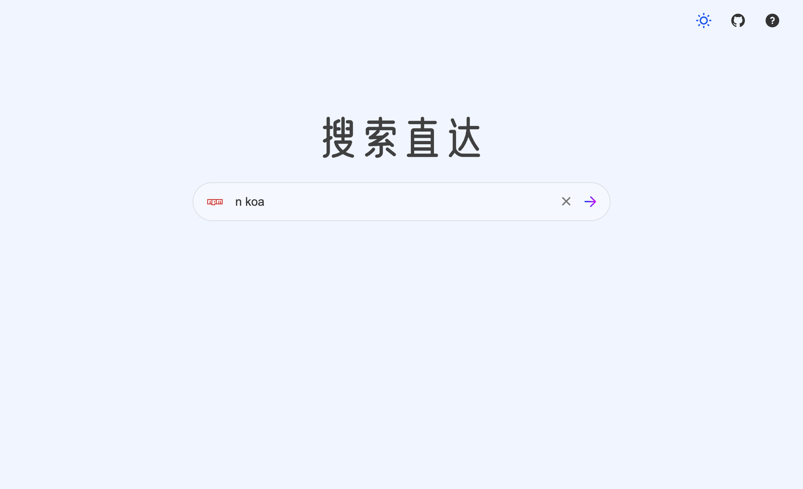
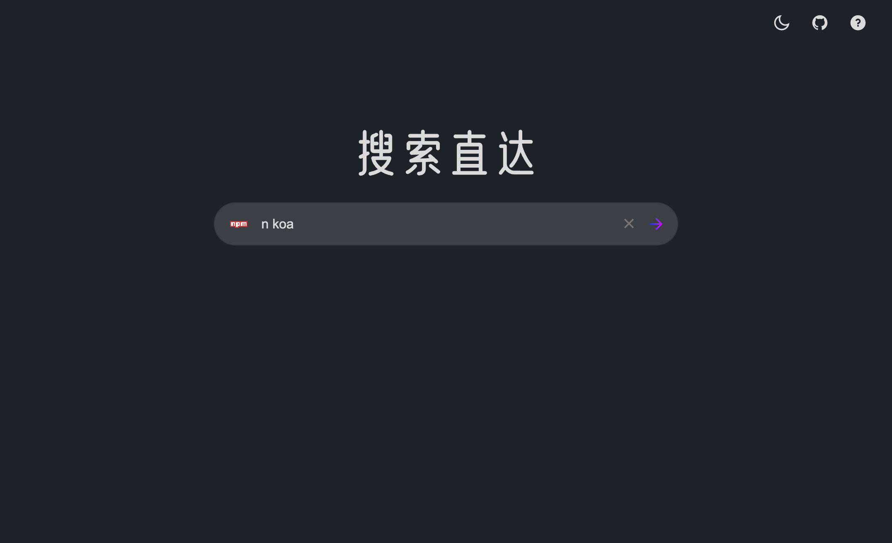

# direct-search

> 通过简单的命令直接到达搜索结果页面的工具。原理很简单，识别输入参数，调用对应的搜索引擎。





# 开发

```
npm run dev
```

# 构建

```
npm run build
```

# 使用

```javascript
搜索引擎/全称 搜索

// e.g.
go 前端框架  // 新开标签，使用谷歌搜索 前端框架

```

# 支持列表

| Name      | Abbreviation                  |
| --------- | ----------------------------- |
| b \| ba   | baidu(百度)                   |
| bf        | baidu-translate(百度翻译)     |
| bw        | baidubaike(百度百科)          |
| bk        | baidukaifa(百度开发搜索)      |
| be        | being(必应)                   |
| bi        | bilibili(哔哩哔哩)            |
| c \| ciu  | caniuse                       |
| c \| cs   | csdn                          |
| dl        | deepl-translate(deepl 翻译)   |
| fsou \| f | fsou(f 搜)                    |
| gi        | github                        |
| go        | google(谷歌)                  |
| gf        | google-translate(google 翻译) |
| j \| jue  | juejin(掘金)                  |
| n         | npm                           |
| se \| sf  | segmentfault(思否)            |
| st        | stackoverflow                 |
| wi        | wikipedia(维基百科)           |
| yt        | youtube                       |
| z \| zhi  | zhihu(知乎)                   |

# 功能

- 支持主流搜索引擎
- 适配深色模式。支持根据环境自动切换。手动切换，将缓存设置结果。

体验地址： ([搜索直达](https://ciro.club/search/))

# 相关

[direct-search-terminal](https://github.com/CiroLee/direct-search-terminal)
